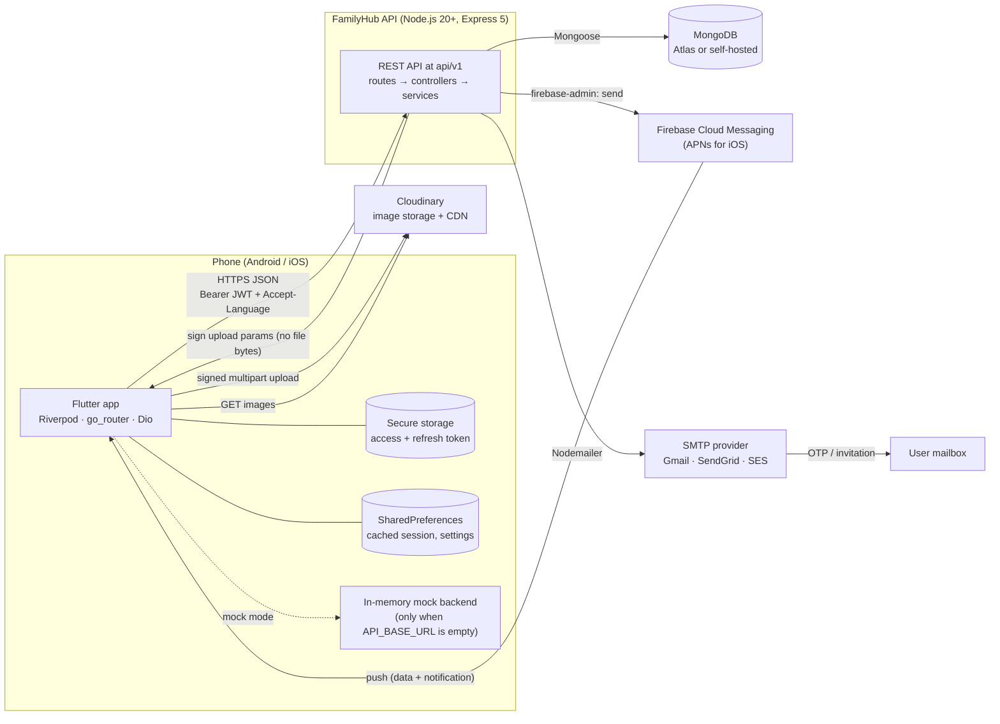
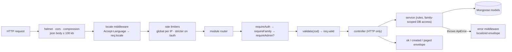
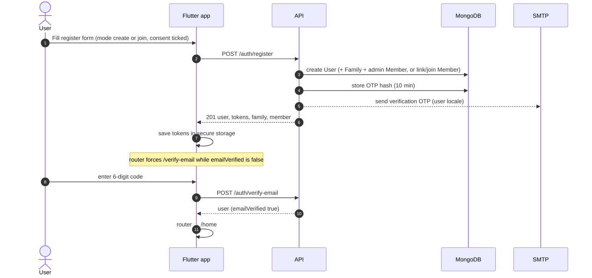
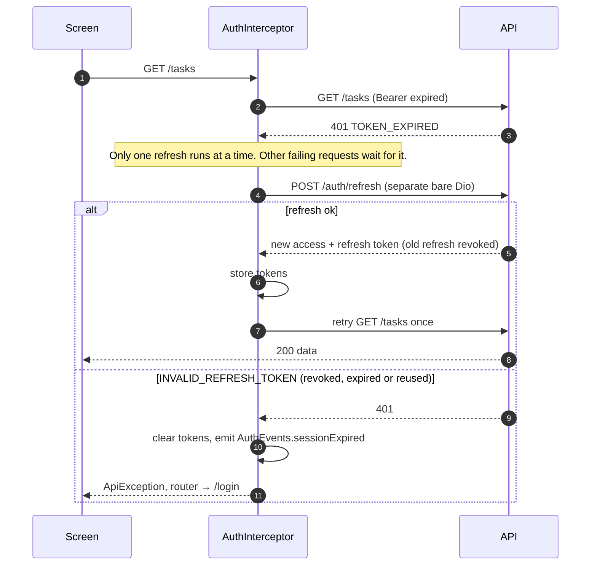
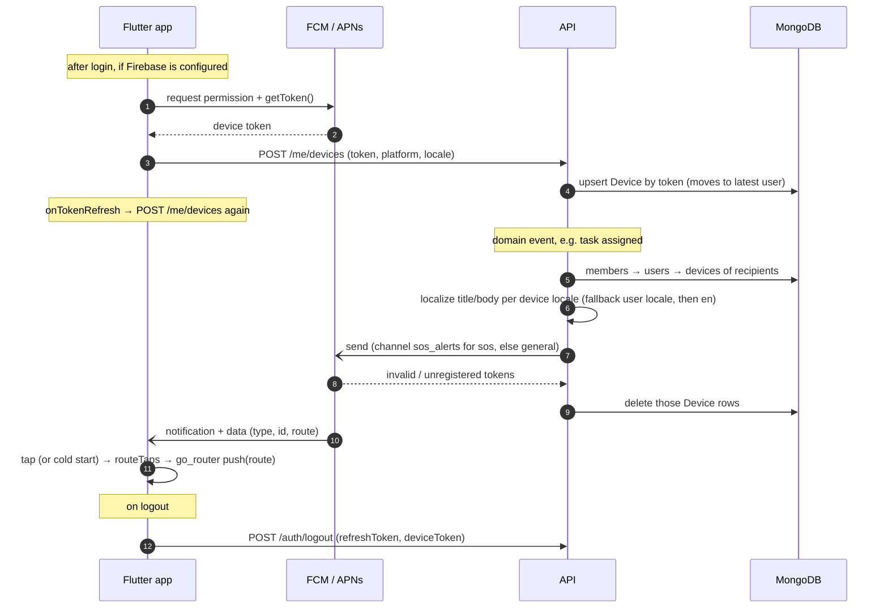
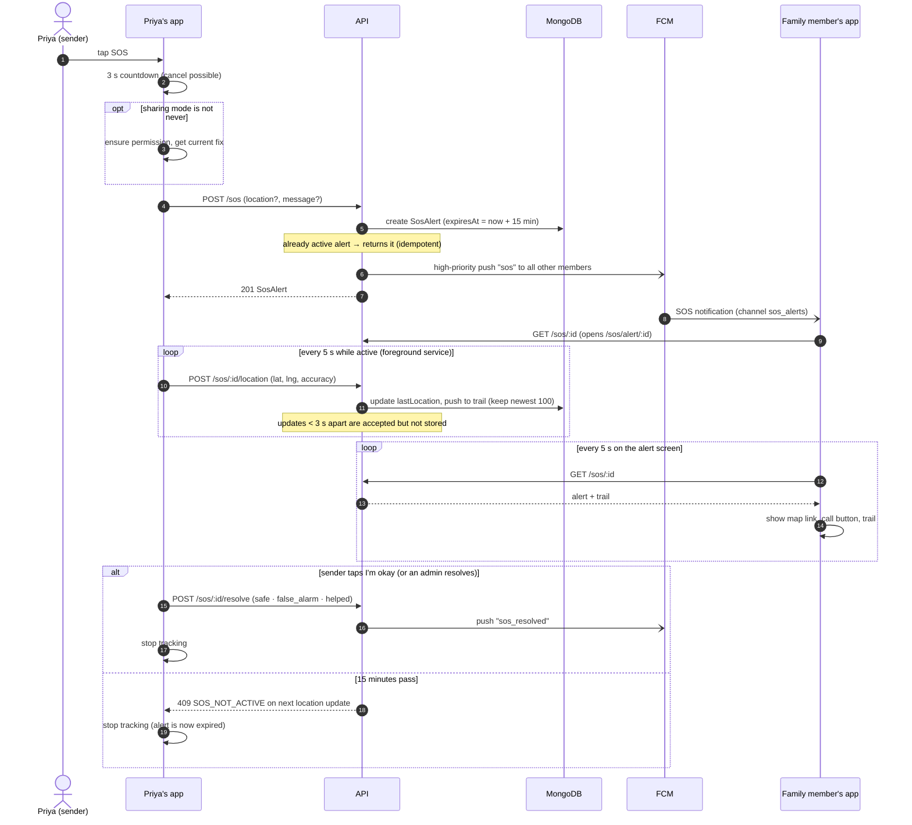
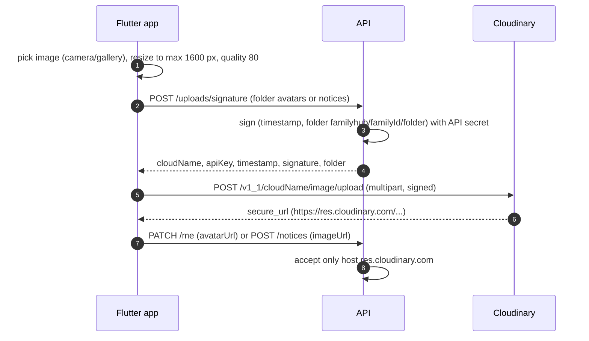
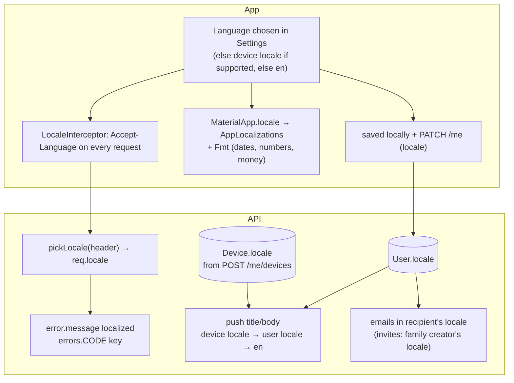
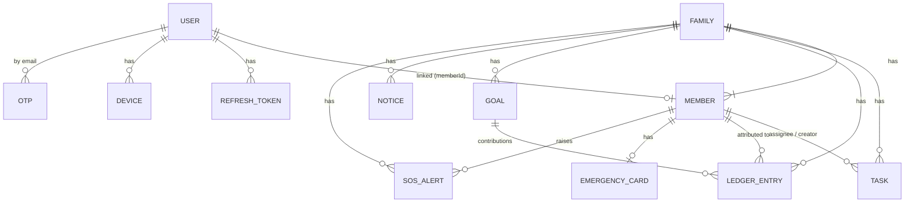
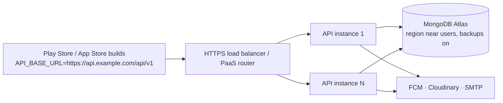

# 02 · Architecture

> How the pieces fit together. Binding details live in [`03-API_CONTRACT.md`](03-API_CONTRACT.md) (API),
> [`05-FLUTTER_GUIDE.md`](05-FLUTTER_GUIDE.md) (app) and [`06-BACKEND_GUIDE.md`](06-BACKEND_GUIDE.md) (backend).
> If this document disagrees with those, they win. Please fix this file.

## 1. System overview

| Component | Responsibility | Tech |
|---|---|---|
| Flutter app (`family_hub_app/`) | All UI, local session cache, device services (push token, location, camera/gallery), direct image upload. | Flutter 3.38, Dart 3.10, Riverpod 3, go_router 17, Dio 5, firebase_messaging, geolocator, image_picker |
| Mock backend (`lib/core/network/mock/`) | Implements the whole API contract in memory inside the app, as a Dio interceptor. | Dart |
| API (`family_hub_backend/`) | Auth, business rules, family scoping, validation, localized errors, push fan-out, email, upload signing. | Node.js ES modules, Express 5, Mongoose 9, Zod 4, jsonwebtoken, bcryptjs, Nodemailer, firebase-admin, cloudinary |
| MongoDB | System of record. One database, collections per model (see §9). | MongoDB 7/8 (Atlas recommended in production) |
| FCM | Push delivery to Android and iOS (via APNs). | Firebase |
| Cloudinary | Stores avatars and notice images, serves them from its CDN. | Cloudinary signed uploads |
| SMTP | Email OTPs (verify email, reset password) and member invitations. | Any SMTP relay |

**Design choices**

- **One REST API, one contract.** The app, the mock backend and the Node API all implement `03-API_CONTRACT.md`.
  Changes go into the contract first.
- **Stateless API.** JWT access tokens let any API instance serve any request. State lives in MongoDB only. This makes
  horizontal scaling trivial.
- **No file bytes through the API.** Images go straight from the phone to Cloudinary, so the API stays small and cheap.
- **Push is fire-and-forget.** API latency never depends on FCM (`void sendToMembers(...)`).
- **Polling for live data.** SOS live location is polled (5 s on the alert screen, 15 s for the global SOS banner).
  Push delivers the alert itself instantly.

## 2. Request lifecycle

- Envelope: `{ success, data, meta? }` or `{ success: false, error: { code, message, details? } }`.
- Unknown errors become `500 INTERNAL_ERROR` with a generic message. No stack traces leave the server.
- On the app side, `ApiClient` unwraps `data` and throws only `ApiException` (with `code`). Screens map codes to
  localized messages with `localizedErrorMessage`.

## 3. Authentication

### 3.1 Tokens

| Token | Format | Lifetime | Stored |
|---|---|---|---|
| Access token | JWT HS256, `sub` = userId (issuer `familyhub-api`, audience `familyhub-app`) | 15 min (`ACCESS_TOKEN_TTL_SECONDS`) | App: secure storage. Server: not stored. |
| Refresh token | Random 48-byte base64url string | 30 days (`REFRESH_TOKEN_TTL_DAYS`), **rotated on every refresh** | App: secure storage. Server: **sha256 hash** only, with TTL index. |
| Email OTP | 6 digits | 10 min, max 5 attempts, resend cooldown 60 s | Server: hash only. |

Reusing a refresh token that was already rotated means it was probably stolen, so the server revokes **all** of that
user's refresh tokens (every device must log in again). A password reset also revokes all refresh tokens.

### 3.2 Register, verify, log in

### 3.3 Expired access token: single-flight refresh

### 3.4 Session restore (app start)

`SessionController.build()` reads tokens → `GET /auth/me`. If the network fails, it restores the **last cached
session** from `LocalCache` so the app still opens offline. The router then decides:
loading → `/splash`; signed out → public routes; unverified → `/verify-email`; no family → `/family-setup`;
otherwise → `/home`.

## 4. Push notifications

| `data.type` | Sent to | Route |
|---|---|---|
| `sos` (high priority, channel `sos_alerts`) | all other members with devices | `/sos/alert/:id` |
| `sos_resolved` | all other members | `/sos/alert/:id` |
| `task_assigned` | assignee (if not the creator) | `/tasks/:id` |
| `task_completed` | creator (if not the completer) | `/tasks/:id` |
| `notice` | all other members | `/notices` |
| `goal_achieved` | whole family | `/money` |
| `member_joined` | other family members (see the backend `family` module for the exact audience) | `/members/:id` |

When Firebase is not configured (`firebase_options.dart` stub on the app, no service account on the backend),
push is a **no-op** on both sides and everything else keeps working.

## 5. SOS with live location

### 5.1 Location sharing modes (per member, default `never`)

| Mode | During SOS | Outside SOS | `lastLocation` visible to family |
|---|---|---|---|
| `never` | Alert is sent **without** location (`locationShared=false`). | Nothing. | No |
| `sos_only` | Live location for the 15-minute window. | Nothing. | No |
| `always` | Live location for the 15-minute window. | Location refreshed when the app is opened/resumed (`PUT /me/location`). | Yes |

The member **always sees** that their location is being shared: an Android foreground-service notification (or iOS
location indicator) during SOS tracking, plus an in-app banner. See [`08-COMPLIANCE.md`](08-COMPLIANCE.md).

### 5.2 Sequence

Notes

- Expiry is **lazy**: an `active` alert past `expiresAt` is persisted/returned as `expired` on the next read. No cron job.
- The global `SosStatusBanner` in the home shell polls `GET /sos/active` every 15 s, so anyone with the app open sees
  an active SOS even if the push was missed.
- The SOS screen always shows the **country emergency number** (from `countries.dart`), which works without mobile data.
  FamilyHub never contacts emergency services itself.

## 6. Image uploads

- The **API secret never leaves the backend**. Signatures are short-lived (Cloudinary rejects old timestamps).
- Optional dev shortcut: an unsigned upload preset (`CLOUDINARY_CLOUD_NAME` + `CLOUDINARY_UPLOAD_PRESET` dart-defines).
  Do not use it in production.
- Mock mode without Cloudinary config: `uploadImage` returns the **local file path**; `AppNetworkImage` renders
  local paths with `Image.file`.

## 7. Internationalisation flow

- **Request-scoped** text (error messages) follows `Accept-Language`.
- **Recipient-scoped** text (push, email) follows the **recipient's** stored locale, never the sender's.
- Missing translation → English → the key itself (backend); the app falls back to English strings.
- Details, language list and formatting rules: [`07-I18N_AND_COUNTRIES.md`](07-I18N_AND_COUNTRIES.md).

## 8. Offline behaviour

| Situation | Behaviour (Phase 1) |
|---|---|
| App starts offline | Session restored from `LocalCache`; screens show errors with **Retry**; `OfflineBanner` shows after a network error. |
| Refreshing a list offline | `AsyncValueView` keeps showing the **previous data** while refreshing; the error is shown as a snackbar or retry. |
| Mutation offline (create task, add entry…) | Fails with `NETWORK_ERROR` → localized snackbar; the form keeps its input so the user can retry. **No offline write queue** in Phase 1. |
| SOS offline | The SOS request fails visibly and can be retried; the emergency number call button still works (phone network, no data). |
| Push while offline | FCM delivers when the device reconnects (subject to FCM TTL). |
| Token expired while offline | Refresh is attempted on the next online request; the stored refresh token stays valid for 30 days. |

## 9. Data model (MongoDB)

Field-level details, collection names (`users`, `refresh_tokens`, `otps`, `families`, `members`, `devices`, `tasks`,
`ledger_entries`, `goals`, `notices`, `sos_alerts`, `emergency_cards`) and indexes: [`04-DATA_MODELS.md`](04-DATA_MODELS.md).

- Every family-owned document carries `familyId`, and every query filters by it.
- Money is stored as **integer minor units** (`amountMinor`, `targetMinor`, `savedMinor`) and exposed as decimals.
- All dates are stored as UTC `Date`. Month and "today/week" ranges use the family's IANA timezone.
- API ids are exposed as `id` (never `_id` / `__v`) via a shared `toJSON` transform; API serializers own the exact
  response shapes.
- The app's mock backend uses camelCase collection names in memory (`sosAlerts`, `ledgerEntries`…); only the names
  differ, the shapes follow the contract.

## 10. Mock backend mode

| | Mock mode | Real API |
|---|---|---|
| Enabled when | `API_BASE_URL` is empty, or `USE_MOCK_API=true` | `API_BASE_URL` is set |
| Where | `MockInterceptor` in the app's Dio stack answers every request | HTTP to the Node API |
| Data | `MockDb` in memory, seeded; **reset on app restart** | MongoDB |
| Latency | Simulated 250–600 ms | Real |
| Auth | Tokens look like `mock-access.<userId>`; OTP is always `123456` | JWT + real OTP by email (or console) |
| Uploads | Returns the local file path (or unsigned Cloudinary if configured) | Signed Cloudinary upload |
| Push | No-op | FCM |

Seed data: "Sharma Family" (India, INR, Asia/Kolkata, invite code `DEMO2345`) with Amit (admin), Priya (admin),
Aarav (teen), Anaya (child, managed profile), Kamla (grandmother, managed profile). Logins:
`demo@familyhub.app` / `demo1234` and `priya@familyhub.app` / `demo1234`.

Every feature registers its handlers in `mock_registry.dart`; features seed their own collections with
`db.seedOnce(...)`. Mock handlers must follow the contract exactly, including error codes, so switching to the real
API changes nothing in the UI.

## 11. Security model

### 11.1 Family scoping

- `requireAuth` loads the user and their member; `requireFamily` rejects users without a family (`403 NO_FAMILY`).
- Every family data query includes `familyId: req.user.familyId`. `findInFamily(Model, id, familyId)` returns the
  document or throws **`404 NOT_FOUND`**. A document from another family is indistinguishable from a missing one.
- Ids in paths are validated (bad ObjectId → `400 BAD_REQUEST`).

### 11.2 Roles and permissions

| Action | Admin | Member |
|---|---|---|
| Edit family settings, rotate invite code, see invite code | Yes | No (`inviteCode` is `null`) |
| Add / remove members, change roles | Yes | No |
| Edit a member profile | Anyone | Only self: `name, phone, avatarUrl, gender, dateOfBirth` |
| Create task | For anyone | Only for self |
| Edit / delete task | Yes | Only tasks they created |
| Complete / reopen task | Yes | Only tasks assigned to them |
| See ledger entries | All | Own (`memberId=self` or `createdById=self`) |
| Ledger summary | Family scope | Personal scope |
| Add ledger entry | For any member | Only for self |
| Create / edit / delete goals | Yes | No |
| Contribute to a goal | Yes | Yes |
| Post notice | Yes (can pin) | Yes (`pinned` ignored) |
| Edit / delete notice | Any | Own |
| Trigger SOS | Yes | Yes |
| Resolve SOS | Any | Own |
| Edit emergency card | Any member's | Own |
| Demote / delete / leave as the last admin | `409 LAST_ADMIN` | — |

The UI hides actions a member cannot perform, but **the backend is the authority** and the app handles
`403 FORBIDDEN` gracefully.

### 11.3 Data protection

| Area | Control |
|---|---|
| Transport | HTTPS in production (TLS terminated at the load balancer / PaaS). HSTS via helmet. |
| Passwords | bcrypt (12 rounds). Min 8 chars with a letter and a digit. |
| Tokens & OTPs | Stored as sha256 hashes; refresh rotation with reuse detection; TTL indexes clean them up. |
| Brute force | Login lockout (5 failures / 15 min per email) + per-IP rate limits (global and stricter on `/auth`). OTP: 5 attempts, 60 s resend cooldown. |
| Enumeration | `forgot-password` always answers `{ sent: true }`; login never says whether the email or the password was wrong. |
| Health fields at rest | `allergies`, `medications`, `conditions`, `insurancePolicyNumber`, `notes` of the emergency card are encrypted with **AES-256-GCM** (`FIELD_ENCRYPTION_KEY`, 32 bytes base64, format `enc:v1:<iv>.<tag>.<cipher>`). The API refuses to start in production without the key. The `v1` prefix leaves room for key rotation. |
| Location | `lastLocation` returned only when the member shares `always`; SOS trail capped at 100 points; `locationSharing` defaults to `never`. |
| Upload URLs | Only `https://res.cloudinary.com/...` accepted for `avatarUrl` / `imageUrl`; uploads go to a per-family folder. |
| Serialisation | Never returns `passwordHash`, token/OTP hashes or encrypted blobs. |
| Logs | No personal data or request bodies in logs; errors return generic messages. |
| Device | Tokens in `flutter_secure_storage` (Keychain / Android Keystore-backed); other cached data in SharedPreferences contains no secrets. |
| Secrets | Only in environment variables (`.env` is git-ignored; `firebase-service-account.json` is git-ignored). |

## 12. Deployment (recommended production topology)

- Any Node host works (Render, Railway, Fly.io, Cloud Run, a VM with PM2). Set `NODE_ENV=production`,
  a strong `JWT_ACCESS_SECRET`, `FIELD_ENCRYPTION_KEY`, a restricted `CORS_ORIGINS`, and configure Express
  `trust proxy` so rate limits see the real client IP.
- Choose the MongoDB region with data residency in mind (for example an India region for Indian families,
  an EU region for EU families). See [`08-COMPLIANCE.md`](08-COMPLIANCE.md).
- Health check: `GET /api/v1/health` → `{ status, db, version }`.
