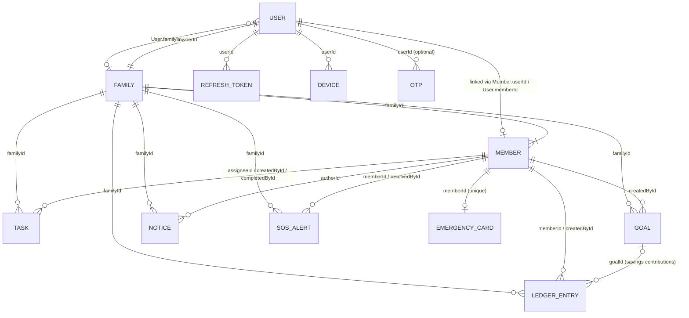

# 04 · Data Models (MongoDB / Mongoose 9)

Source: `family_hub_backend/src/models/`. Implements the model list in `06-BACKEND_GUIDE.md` §4 with the enums and
limits of `03-API_CONTRACT.md`. If this document and the code disagree, the contract wins, then the code; fix this file.

## 0. Conventions

| Topic | Rule |
|---|---|
| Import | `import { Task, TASK_STATUSES } from '../models/index.js'`. Each file also exports its model as default and named (`export const Task = mongoose.models.Task \|\| mongoose.model(...)`). Importing models never connects to the DB. |
| Enums / limits | `src/models/enums.js` is the single source; `src/lib/constants.js` re-exports it. Never re-type enum strings. |
| Timestamps | Every schema has `timestamps: true` → `createdAt`, `updatedAt` (UTC `Date`). |
| Collections | Explicit snake_case names (see each table heading). |
| IDs in JSON | Shared `applyToJson` transform (`schemaUtils.js`): `id` (string), no `_id`, no `__v`, ObjectIds flattened to hex strings, virtuals included, secret fields removed. It is applied **per schema** because ES-module imports compile the models before `models/index.js` could call `mongoose.plugin()`. It composes with `lib/mongoosePlugins.js#toJsonPlugin`. API serializers still own the exact response shapes. |
| People references | Every `*Id` that names a person inside a family (`assigneeId`, `createdById`, `authorId`, `resolvedById`, `updatedById`, `memberId`, …) is a **Member** id. Only `User.*`, `RefreshToken.userId`, `Otp.userId`, `Device.userId`, `Member.userId` and `Family.ownerId` reference **User**. |
| Money | Integer minor units (`amountMinor`, `targetMinor`, `savedMinor`), validated as safe integers. The API exposes decimal major units via `lib/money.js`. Max `1e14` minor (= contract `1e12` major). |
| Optional strings | Trimmed, `'' → null` (setter `emptyToNull`), default `null`. That matters for partial unique indexes: an empty e-mail must never be stored as `''`. |
| Length limits | Where the contract gives a limit, the model uses exactly that limit. Other limits are generous **backstops** marked *(backstop)*; the zod schemas are the user-facing validation. See `LIMITS` in `enums.js`. |
| Hooks | Mongoose 9: `async function` hooks, no `next()`. Helpers use `returnDocument: 'after'`, never `new: true`. |
| Indexes | Built by autoIndex on connect. Tests and seeds that depend on unique or TTL indexes call `await initModels()` after `mongoose.connect()`. Deploy and migration scripts can call `syncAllIndexes()`. |

## 1. Collections

### User (`users`)
| Field | Type | Req | Default | Notes |
|---|---|---|---|---|
| email | String | ✓ | – | trim, lowercase, ≤254, **unique** |
| passwordHash | String | ✓ | – | bcrypt; hidden from toJSON |
| name | String | ✓ | – | trim, 1–60 |
| locale | String | | `en` | enum `en hi bn ta te mr gu kn ml pa ar es fr pt de`; push/e-mail language |
| emailVerified | Boolean | | `false` | |
| familyId | ObjectId→Family | | `null` | null = no family (create/join screen) |
| memberId | ObjectId→Member | | `null` | |
| failedLoginCount | Number ≥0 | | `0` | hidden from toJSON |
| lastFailedLoginAt | Date | | `null` | start of the 15-min failure window (extra field for the lockout rule); hidden |
| lockUntil | Date | | `null` | login locked until; hidden. Virtual `isLocked` |
| lastLoginAt | Date | | `null` | |
| consentAcceptedAt | Date | | `null` | privacy policy + terms acceptance (consent record) |

Indexes: `{email:1}` unique · `{familyId:1}`.

### RefreshToken (`refresh_tokens`)
| Field | Type | Req | Default | Notes |
|---|---|---|---|---|
| userId | ObjectId→User | ✓ | – | |
| tokenHash | String | ✓ | – | sha256 of the opaque token, **unique**; hidden |
| expiresAt | Date | ✓ | – | now + 30 days; **TTL** |
| revokedAt | Date | | `null` | set on rotation, logout or reset |
| replacedByHash | String | | `null` | rotation chain; hidden |
| ip | String | | `null` | truncated to 512 chars (never rejected) |
| userAgent | String | | `null` | truncated to 512 chars |

Indexes: `{tokenHash:1}` unique · `{userId:1}` · `{expiresAt:1}` TTL `expireAfterSeconds: 0`.
Method `isActive(now)`. Revoked rows are kept until expiry so a reused (rotated) token can be detected.

### Otp (`otps`)
| Field | Type | Req | Default | Notes |
|---|---|---|---|---|
| email | String | ✓ | – | trim, lowercase |
| purpose | String | ✓ | – | `verify_email` \| `reset_password` |
| codeHash | String | ✓ | – | sha256 of the 6-digit code; hidden |
| expiresAt | Date | ✓ | – | sent + 10 min |
| attempts | Number ≥0 | | `0` | max 5 (service) |
| lastSentAt | Date | | now | resend cooldown 60 s |
| userId | ObjectId→User | | `null` | |

Indexes: `{email:1,purpose:1}` unique (one live code per purpose; re-send = upsert) · `{expiresAt:1}` **TTL with a 1 h grace**
(`OTP_PURGE_GRACE_SECONDS = 3600`), so the API can still answer `OTP_EXPIRED` rather than `INVALID_OTP`. Services must always
compare `expiresAt` themselves (`otp.isExpired(now)`).

### Family (`families`)
| Field | Type | Req | Default | Notes |
|---|---|---|---|---|
| name | String | ✓ | – | trim, 1–60 |
| inviteCode | String | ✓ | random | 8 chars `[ABCDEFGHJKLMNPQRSTUVWXYZ23456789]`, stored uppercase, **unique**. Look-ups must uppercase the input. On a duplicate-key error (11000) the service regenerates the code |
| country | String | ✓ | – | ISO 3166-1 alpha-2, uppercased |
| currency | String | ✓ | – | ISO 4217, uppercased |
| timezone | String | ✓ | – | IANA, validated with `Intl.DateTimeFormat` |
| ownerId | ObjectId→User | ✓ | – | creator |

Indexes: `{inviteCode:1}` unique. `memberCount` is computed. `inviteCode` is returned to admins only (serializer).

### Member (`members`)
| Field | Type | Req | Default | Notes |
|---|---|---|---|---|
| familyId | ObjectId→Family | ✓ | – | |
| userId | ObjectId→User | | `null` | null → managed profile; virtual `hasAccount` |
| name | String | ✓ | – | trim, 1–60 |
| email | String | | `null` | trim, lowercase, `'' → null` |
| phone | String | | `null` | ≤32 *(backstop)* |
| avatarUrl | String | | `null` | Cloudinary URL, ≤1024 *(backstop)* |
| dateOfBirth | Date | | `null` | age is computed client-side |
| gender | String | | `null` | `male` \| `female` \| `other` |
| designation | String | | `null` | free-text "company title", ≤80 *(backstop)* |
| role | String | ✓ | `member` | `admin` \| `member` |
| locationSharing | String | ✓ | `never` | `never` \| `sos_only` \| `always`, **private by default** |
| lastLocation | {lat,lng,accuracy,recordedAt} | | `null` | lat −90..90, lng −180..180, accuracy ≥0; serialised only when `locationSharing='always'` |
| guardianConsent | Boolean | | `false` | required `true` below the country consent age (service) |
| guardianConsentAt | Date | | `null` | |
| guardianConsentById | ObjectId→Member | | `null` | admin who confirmed |

Indexes: `{familyId:1,role:1}` (list and count admins) · `{familyId:1,email:1}` **unique partial** (`email: {$type:'string'}`) ·
`{userId:1}` **unique partial** (`userId: {$type:'objectId'}`).

### Device (`devices`)
| Field | Type | Req | Default | Notes |
|---|---|---|---|---|
| userId | ObjectId→User | ✓ | – | a token moves to the latest user (upsert by token) |
| token | String | ✓ | – | FCM token, ≤4096, **unique** |
| platform | String | ✓ | – | `android` \| `ios` |
| locale | String | | `null` | device language override (falls back to user locale) |
| lastSeenAt | Date | | now | bumped automatically on `save`, `findOneAndUpdate` and `updateOne` unless set explicitly; **TTL 270 days** |

Indexes: `{token:1}` unique · `{userId:1}` · `{lastSeenAt:1}` TTL `DEVICE_STALE_AFTER_SECONDS` (270 d, FCM's staleness horizon).

### Task (`tasks`)
| Field | Type | Req | Default | Notes |
|---|---|---|---|---|
| familyId | ObjectId→Family | ✓ | – | |
| title | String | ✓ | – | trim, 1–120 |
| description | String | | `null` | ≤1000 |
| assigneeId | ObjectId→Member | ✓ | – | |
| createdById | ObjectId→Member | ✓ | – | |
| dueDate | Date | | `null` | |
| category | String | ✓ | `other` | `study chore skill health errand other` |
| priority | String | ✓ | `medium` | `low medium high` |
| status | String | ✓ | `pending` | `pending done` |
| completedAt | Date | | `null` | |
| completedById | ObjectId→Member | | `null` | |

Indexes: `{familyId:1,status:1,dueDate:1}` · `{familyId:1,assigneeId:1,status:1}`. Method `isOverdue(startOfToday)`.

### LedgerEntry (`ledger_entries`)
| Field | Type | Req | Default | Notes |
|---|---|---|---|---|
| familyId | ObjectId→Family | ✓ | – | |
| type | String | ✓ | – | `income` \| `expense` |
| amountMinor | Integer | ✓ | – | 1..1e14 |
| category | String | ✓ | – | must belong to `type` (also checked in update validators): income `salary business allowance gift interest other_income`; expense `groceries utilities rent education health transport dining shopping entertainment household_help savings other_expense` |
| note | String | | `null` | ≤200 |
| date | Date | ✓ | – | business date (family-local midnight in UTC) |
| memberId | ObjectId→Member | ✓ | – | whose money it is |
| memberName | String | ✓ | – | snapshot, 1–60; keeps entries readable after the member is deleted |
| createdById | ObjectId→Member | ✓ | – | |
| goalId | ObjectId→Goal | | `null` | set on `expense/savings` entries created by goal contributions |

Indexes: `{familyId:1,date:-1}` · `{familyId:1,memberId:1,date:-1}` · `{goalId:1}`.

### Goal (`goals`)
| Field | Type | Req | Default | Notes |
|---|---|---|---|---|
| familyId | ObjectId→Family | ✓ | – | |
| title | String | ✓ | – | trim, 1–80 |
| description | String | | `null` | ≤1000 *(backstop)* |
| targetMinor | Integer | ✓ | – | 1..1e14 |
| savedMinor | Integer | | `0` | ≥0; change with atomic `$inc` (bypasses validators, so the service clamps at 0) |
| targetDate | Date | | `null` | |
| status | String | ✓ | `active` | `active achieved archived` |
| createdById | ObjectId→Member | ✓ | – | |
| achievedAt | Date | | `null` | |

Indexes: `{familyId:1,status:1}`. Virtual `progress` = saved/target, truncated to 4 decimals, capped to [0, 1].

### Notice (`notices`)
| Field | Type | Req | Default | Notes |
|---|---|---|---|---|
| familyId | ObjectId→Family | ✓ | – | |
| title | String | ✓ | – | trim, 1–100 |
| body | String | ✓ | – | trim, 1–2000 |
| imageUrl | String | | `null` | Cloudinary URL, ≤1024 *(backstop)* |
| pinned | Boolean | | `false` | admin only (service) |
| authorId | ObjectId→Member | ✓ | – | |

Indexes: `{familyId:1,pinned:-1,createdAt:-1}`.

### SosAlert (`sos_alerts`)
| Field | Type | Req | Default | Notes |
|---|---|---|---|---|
| familyId | ObjectId→Family | ✓ | – | |
| memberId | ObjectId→Member | ✓ | – | who raised it |
| status | String | ✓ | `active` | `active resolved expired`; lazy expiry (below) |
| message | String | | `null` | ≤140 |
| locationShared | Boolean | | `false` | false when the member's mode is `never` (no location is stored) |
| lastLocation | point | | `null` | same shape as `Member.lastLocation` |
| trail | point[] | | `[]` | ≤100, append with `$push: {trail: {$each:[p], $slice: -100}}` |
| lastLocationAt | Date | | `null` | last *stored* update (3 s throttle, `SOS_MIN_LOCATION_INTERVAL_MS`) |
| startedAt | Date | ✓ | now | |
| expiresAt | Date | ✓ | startedAt + 15 min | `SOS_DURATION_MS` |
| resolvedAt | Date | | `null` | |
| resolvedById | ObjectId→Member | | `null` | |
| resolution | String | | `null` | `safe false_alarm helped` |

Indexes: `{familyId:1,status:1}` · `{memberId:1,status:1}`.
Helpers: `SosAlert.expireStale(filter, now)` persists lazy expiry (active + `expiresAt ≤ now` → `expired`) and returns the count.
`alert.effectiveStatus(now)` and `alert.isActive(now)`. List endpoints should `.select('-trail')`.

### EmergencyCard (`emergency_cards`)
| Field | Type | Req | Default | Notes |
|---|---|---|---|---|
| familyId | ObjectId→Family | ✓ | – | |
| memberId | ObjectId→Member | ✓ | – | **unique** (one card per member) |
| bloodGroup | String | ✓ | `unknown` | `A+ A- B+ B- AB+ AB- O+ O- unknown` |
| allergiesEnc | String | | `null` | 🔒 AES-256-GCM of `string[]` (≤20 × 80) |
| medicationsEnc | String | | `null` | 🔒 `string[]` |
| conditionsEnc | String | | `null` | 🔒 `string[]` |
| doctorName | String | | `null` | ≤100 *(backstop)* |
| doctorPhone | String | | `null` | ≤32 *(backstop)* |
| insuranceProvider | String | | `null` | ≤100 *(backstop)* |
| insurancePolicyNumberEnc | String | | `null` | 🔒 string |
| emergencyContacts | [{name ✓ ≤100, phone ≤32, relation ≤60}] | | `[]` | ≤5 |
| notesEnc | String | | `null` | 🔒 string (≤500 plaintext) |
| updatedById | ObjectId→Member | | `null` | self or admin |

Indexes: `{memberId:1}` unique · `{familyId:1}`.
Plaintext virtuals `allergies`, `medications`, `conditions`, `insurancePolicyNumber` and `notes` encrypt on set and decrypt on get
(lists read `[]` when empty, strings read `null`). Blank values are stored as `null`. Methods: `card.toPlainCard()` returns
the contract shape. `EmergencyCard.emptyCard(memberId)` returns the contract's empty card (`updatedAt: null`).
`ENCRYPTED_CARD_FIELDS` maps each virtual to its stored path. Virtuals do not exist on `.lean()` results; decrypt those
with `lib/crypto.js#decryptField`.

## 2. Relationships

Cascades are implemented in services (MongoDB has no foreign keys):
- **Delete member:** unlink the user (`familyId/memberId = null`, revoke refresh tokens, delete devices). Delete the member's
  **pending** tasks and its emergency card. Resolve its active SOS. Ledger entries remain and keep `memberName`.
- **Delete goal:** linked ledger entries remain, with `goalId → null`.
- **Delete ledger entry with goalId:** `$inc` goal `savedMinor` by `-amountMinor` (clamped at 0). Reopen the goal if it drops below target.
- **Delete account** (`DELETE /me`): user, member, card, devices and tokens. If the caller is the last member, delete the
  whole family and all its collections.
- **Family scoping:** every family-data query filters by `familyId` (`lib/access.js`). Another family's document → 404.

## 3. Privacy & retention

| Data | Protection |
|---|---|
| Passwords | bcrypt `passwordHash` only. Hidden from toJSON and never serialised. |
| Refresh tokens / OTPs | Stored as sha256 hashes (`tokenHash`, `replacedByHash`, `codeHash`) and hidden from toJSON. |
| Health data | `allergies`, `medications`, `conditions`, `insurancePolicyNumber` and `notes` are **encrypted at rest** (AES-256-GCM, key `FIELD_ENCRYPTION_KEY`, format `enc:v1:<iv>.<tag>.<cipher>`). Raw `*Enc` blobs are removed from toJSON. A decryption failure throws rather than silently showing "no allergies". |
| Location | `Member.locationSharing` defaults to `never`. `lastLocation` is only serialised for `always`. SOS drops the location when the mode is `never`. The trail is capped at 100 points. |
| Children | `guardianConsent`, `guardianConsentAt` and `guardianConsentById` record verifiable guardian consent. |
| Consent | `User.consentAcceptedAt` records acceptance of the privacy policy and terms. |
| Logs / metadata | `ip` / `userAgent` on refresh tokens only, truncated to 512 chars, deleted with the token. |

TTL indexes (MongoDB's TTL monitor runs about every 60 s, so services must still check expiry themselves):

| Collection | Field | Deleted |
|---|---|---|
| `refresh_tokens` | `expiresAt` | at expiry (30 days after issue) |
| `otps` | `expiresAt` | 1 h after expiry (10 min validity) |
| `devices` | `lastSeenAt` | 270 days without any registration or update |

Not auto-deleted (product history): tasks, ledger, goals, notices, SOS history. Deleting the account or family removes them
as described above. A retention window for SOS trails can be added later with a partial TTL.

## 4. Design decisions

1. **Per-schema toJSON transform** instead of a global plugin, because of ESM evaluation order (see §0).
2. **Explicit collection names** (snake_case) for readable ops and backups.
3. **Partial unique indexes** on `Member.email` and `Member.userId`, so managed profiles (no e-mail, no account) never collide.
4. **No DB-level "one active SOS per member" unique index.** The guide specifies non-unique `{memberId,status}`, and the lazily
   expired `active` rows would make inserts fail with 11000. The SOS service must call `expireStale({ memberId })` and
   then look up the active alert before creating one (idempotent create).
5. **Model limits = contract limits.** Where the contract is silent, a generous backstop applies, so zod stays the user-facing
   validator and a model `ValidationError` indicates a programming error.
6. **Device TTL + auto-touch** removes stale FCM tokens (data minimisation) without every caller having to remember `lastSeenAt`.
7. **OTP TTL grace (1 h)** allows the clearer `OTP_EXPIRED` error instead of `INVALID_OTP` shortly after expiry.
