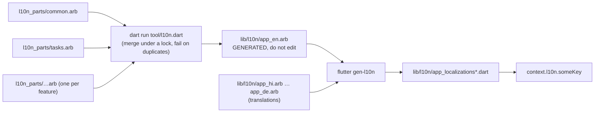

# 07 · Internationalisation & Countries

> FamilyHub must work in many countries and many languages. This document lists what is supported, how text and
> formats are produced, and how to add a language or a country.
> Binding rules: [`05-FLUTTER_GUIDE.md` §6](05-FLUTTER_GUIDE.md) (app) and [`06-BACKEND_GUIDE.md` §5](06-BACKEND_GUIDE.md) (backend).
> Architecture of the locale flow: [`02-ARCHITECTURE.md` §7](02-ARCHITECTURE.md).

## 1. Supported languages (15)

The same 15 codes are used everywhere: `AppLanguages.all` (app), `LOCALES` / `SUPPORTED_LOCALES` (backend),
the `locale` validation in the API contract, and the ARB / JSON file names.

| Code | Native name | English name | Script | Direction | Digits shown by `Fmt` (intl default) | Default grouping |
|---|---|---|---|---|---|---|
| `en` | English | English | Latin | LTR | 0-9 | `#,##0` (`en_IN`: `#,##,##0`) |
| `hi` | हिन्दी | Hindi | Devanagari | LTR | 0-9 | `#,##,##0` (lakh) |
| `bn` | বাংলা | Bengali | Bengali (Bangla) | LTR | **০-৯** (Bengali) | `#,##,##0` |
| `ta` | தமிழ் | Tamil | Tamil | LTR | 0-9 | `#,##,##0` |
| `te` | తెలుగు | Telugu | Telugu | LTR | 0-9 | `#,##,##0` |
| `mr` | मराठी | Marathi | Devanagari | LTR | **०-९** (Devanagari) | `#,##,##0` |
| `gu` | ગુજરાતી | Gujarati | Gujarati | LTR | 0-9 | `#,##,##0` |
| `kn` | ಕನ್ನಡ | Kannada | Kannada | LTR | 0-9 | `#,##0` |
| `ml` | മലയാളം | Malayalam | Malayalam | LTR | 0-9 | `#,##,##0` |
| `pa` | ਪੰਜਾਬੀ | Punjabi | Gurmukhi | LTR | 0-9 | `#,##,##0` |
| `ar` | العربية | Arabic | Arabic | **RTL** | 0-9 (`ar` in intl uses Latin digits) | `#,##0` |
| `es` | Español | Spanish | Latin | LTR | 0-9 | `#,##0` (`.` grouping, `,` decimal; `es_MX`: `,` grouping) |
| `fr` | Français | French | Latin | LTR | 0-9 | narrow no-break space grouping, `,` decimal |
| `pt` | Português | Portuguese | Latin | LTR | 0-9 | `.` grouping, `,` decimal |
| `de` | Deutsch | German | Latin | LTR | 0-9 | `.` grouping, `,` decimal |

Digits and grouping come from `package:intl` 0.20.2 locale data (checked in `number_symbols_data.dart`).
All 15 languages are supported by Flutter's `GlobalMaterialLocalizations`, so date pickers, dialogs and other
Material widgets are translated too.

### Where each piece of text comes from

| Text | Source | Language used |
|---|---|---|
| App UI | `lib/l10n/app_<code>.arb` → generated `AppLocalizations` | App language (settings → device → `en`) |
| Enum labels (roles, categories…) | `*Labels` extensions reading `context.l10n` | App language |
| API error `message` | `src/i18n/locales/<code>/common.json` → `errors.<CODE>` | `Accept-Language` of the request |
| Push notification title/body | `src/i18n/locales/<code>/<ns>.json` → `<ns>.push.<event>.title\|body` | **Recipient's** device locale → user locale → `en` |
| Emails (OTP, invitation) | `<ns>.email.<name>.subject\|text` | **Recipient's** user locale (invitations: the family creator's locale, since the invitee has no account yet) |
| Material widgets | `GlobalMaterialLocalizations` | App language |

The app always prefers its own `localizedErrorMessage(code)` over the server `message`; the server text is a
fallback for codes the app does not know yet.

## 2. Language resolution

1. The language the user picked in **Settings → Language** (stored locally and sent to the API with `PATCH /me { locale }`).
2. Otherwise the **device locale**, if its language code is one of the 15.
3. Otherwise **English**.

The chosen code is sent as `Accept-Language` on every request (`LocaleInterceptor`). The backend's `pickLocale`
honours q-values and maps regional tags to the language (`hi-IN` → `hi`, `pt_BR` → `pt`); anything unsupported → `en`.

## 3. App: ARB fragment workflow

Many engineers add strings at the same time, so English strings are split into **one fragment per feature** and
merged into the single template that `flutter gen-l10n` needs.



**Commands** (run from `family_hub_app/`):

| Command | What it does |
|---|---|
| `dart run tool/l10n.dart` | Merge `l10n_parts/*.arb` → `lib/l10n/app_en.arb`, then run `flutter gen-l10n`. **Preferred.** |
| `dart run tool/l10n.dart --no-gen` | Merge only. |
| `dart run tool/merge_arb.dart && flutter gen-l10n` | Same as the first command, in two steps (the form used in `05-FLUTTER_GUIDE.md`). |

The merge tool:

- fails (and leaves `app_en.arb` unchanged) on invalid JSON, **duplicate keys** (within one file or across files; it
  prints both file names), invalid key names, non-string messages or non-object metadata;
- warns about metadata without a message and fragments that declare a `@@locale` other than `en`;
- is safe to run concurrently: an atomic lock directory `.l10n.lock` serialises runs, and stale locks from crashed runs
  are broken automatically.

**Key rules**

- camelCase, **prefixed with the feature**: `tasksTitle`, `ledgerAddEntry`, `sosSendingIn`. Shared prefixes:
  `common*`, `error*`, `validation*`, and `role*` / `gender*` / `ageGroup*` / `locationSharing*` for shared enums.
- Every key with placeholders or plurals has an `@key` block with typed placeholders:

  ```json
  "tasksPendingCount": "{count, plural, =0{No pending tasks} =1{1 pending task} other{{count} pending tasks}}",
  "@tasksPendingCount": { "description": "Dashboard member row", "placeholders": { "count": { "type": "int" } } }
  ```

- Never build sentences by concatenating strings. Use one message with placeholders so translators can reorder words.
- Never put numbers, dates or money into a message as pre-formatted English. Format with `Fmt` and pass the result as a
  `String` placeholder.
- Add a `description` for anything ambiguous ("Save" as verb, "Due" as adjective…).

## 4. Backend: translation files

```
family_hub_backend/src/i18n/locales/<code>/
  common.json   errors.<CODE>, email layout (greeting, signature)
  auth.json     auth.email.verify|reset.subject|text
  family.json   invitation email, member_joined push
  tasks.json    tasks.push.assigned|completed.title|body
  ledger.json   ledger.push.goalAchieved…
  notices.json  notices.push.new…
  sos.json      sos.push.alert|resolved…
```

- Key = `<namespace>.<json.path>`; `t(locale, key, vars)` replaces `{name}` placeholders.
- Lookup: requested locale → English → the key itself. A broken JSON file is skipped with a warning and English is
  used, so a bad translation can never take the API down.
- **No ICU plurals on the backend.** Write push/email texts so they need no plural forms
  (e.g. "Tasks completed: {count}" rather than "{count} tasks completed").

## 5. How to add a language

Example: adding Urdu (`ur`, RTL).

**Decide first**

1. Check that Flutter's `GlobalMaterialLocalizations` supports the code (the list is in the Flutter docs,
   `kMaterialSupportedLanguages`). If not, Material widgets fall back to English and you need a custom delegate.
2. Check `package:intl` has number/date data for it (`number_symbols_data.dart`, `date_symbol_data_local.dart`).
   If not, `Fmt` falls back to `en` formatting.
3. Update the contract first: add the code to the supported `locale` list in [`03-API_CONTRACT.md` §5](03-API_CONTRACT.md).

**App (`family_hub_app/`)**

1. Add `AppLanguage('ur', 'اردو', 'Urdu')` to `lib/core/config/app_languages.dart`.
2. Copy `lib/l10n/app_en.arb` to `lib/l10n/app_ur.arb`, set `"@@locale": "ur"`, translate every **value**
   (keep keys, placeholders and ICU structure; add the plural categories the language needs, see §7). Do not copy
   `@key` metadata blocks; they belong to the template only.
3. Run `dart run tool/l10n.dart`. `flutter gen-l10n` lists untranslated keys; fix them all.
4. iOS: add the code to `CFBundleLocalizations` in `ios/Runner/Info.plist` so iOS system dialogs use it.
   Android 13+: add it to the per-app language config (`res/xml/locales_config.xml`) if the project uses one.
5. RTL languages: run the RTL checklist (§8). Fonts: check rendering on a low-end Android device.
6. Run `flutter analyze && flutter test`.

**Backend (`family_hub_backend/`)**

1. Add the code to `LOCALES` in `src/models/enums.js` (re-exported as `SUPPORTED_LOCALES`), which also updates the
   zod `locale` validation.
2. Create `src/i18n/locales/ur/` with the **same file set and keys** as `en/`.
3. Run `npm test` (the i18n tests check key parity when present).

**Docs**: add a row to §1 above and update [`TASKS.md`](TASKS.md).

## 6. Countries

A family picks its **country** at creation. The country drives the default currency (the family may choose another
one, e.g. expats), the **emergency number** shown on SOS screens, the phone dial code, the default language
suggestion, and the **digital age of consent** (`consentAge`): adding a member younger than this requires guardian
consent (`422 GUARDIAN_CONSENT_REQUIRED` otherwise).

Sources (must stay identical): `family_hub_app/lib/core/config/countries.dart` and
`family_hub_backend/src/lib/countries.js`. Unknown country codes fall back to India (`IN`) in lookups, and
`consentAge()` falls back to **18** (the strictest value) so a typo can never lower protection.

| Code | Country | Dial | Currency | Emergency no. | Consent age | Privacy law (as in `countries.dart`) | Default lang | Suggested timezone | intl format locale (with `en`) |
|---|---|---|---|---|---|---|---|---|---|
| IN | India | +91 | INR | 112 | 18 | Digital Personal Data Protection Act, 2023 | hi | Asia/Kolkata | `en_IN` |
| AE | United Arab Emirates | +971 | AED | 999 | 18 | UAE PDPL | ar | Asia/Dubai | `en` |
| AU | Australia | +61 | AUD | 000 | 16 | Privacy Act 1988 | en | Australia/Sydney * | `en_AU` |
| BD | Bangladesh | +880 | BDT | 999 | 18 | Personal Data Protection Ordinance | bn | Asia/Dhaka | `en` |
| BR | Brazil | +55 | BRL | 190 | 18 | LGPD | pt | America/Sao_Paulo * | `en` (`pt_BR` with pt) |
| CA | Canada | +1 | CAD | 911 | 13 | PIPEDA | en | America/Toronto * | `en_CA` |
| DE | Germany | +49 | EUR | 112 | 16 | GDPR | de | Europe/Berlin | `en` |
| ES | Spain | +34 | EUR | 112 | 14 | GDPR | es | Europe/Madrid | `en` (`es_ES` with es) |
| FR | France | +33 | EUR | 112 | 15 | GDPR | fr | Europe/Paris | `en` |
| GB | United Kingdom | +44 | GBP | 999 | 13 | UK GDPR | en | Europe/London | `en_GB` |
| ID | Indonesia | +62 | IDR | 112 | 18 | PDP Law | en | Asia/Jakarta * | `en` |
| IT | Italy | +39 | EUR | 112 | 14 | GDPR | en | Europe/Rome | `en` |
| KE | Kenya | +254 | KES | 999 | 18 | Data Protection Act 2019 | en | Africa/Nairobi | `en` |
| LK | Sri Lanka | +94 | LKR | 119 | 18 | PDPA 2022 | ta | Asia/Colombo | `en` |
| MX | Mexico | +52 | MXN | 911 | 18 | LFPDPPP | es | America/Mexico_City * | `en` (`es_MX` with es) |
| MY | Malaysia | +60 | MYR | 999 | 18 | PDPA 2010 | en | Asia/Kuala_Lumpur | `en_MY` |
| NG | Nigeria | +234 | NGN | 112 | 18 | NDPA 2023 | en | Africa/Lagos | `en` |
| NL | Netherlands | +31 | EUR | 112 | 16 | GDPR | en | Europe/Amsterdam | `en` |
| NP | Nepal | +977 | NPR | 100 | 18 | Privacy Act 2018 | hi | Asia/Kathmandu | `en` |
| NZ | New Zealand | +64 | NZD | 111 | 16 | Privacy Act 2020 | en | Pacific/Auckland | `en_NZ` |
| PH | Philippines | +63 | PHP | 911 | 18 | Data Privacy Act 2012 | en | Asia/Manila | `en` |
| PK | Pakistan | +92 | PKR | 1122 | 18 | PECA 2016 | en | Asia/Karachi | `en` |
| PT | Portugal | +351 | EUR | 112 | 13 | GDPR | pt | Europe/Lisbon * | `en` (`pt_PT` with pt) |
| QA | Qatar | +974 | QAR | 999 | 18 | PDPPL | ar | Asia/Qatar | `en` |
| SA | Saudi Arabia | +966 | SAR | 911 | 18 | PDPL | ar | Asia/Riyadh | `en` |
| SG | Singapore | +65 | SGD | 995 | 13 | PDPA | en | Asia/Singapore | `en_SG` |
| US | United States | +1 | USD | 911 | 13 | COPPA / state privacy laws | en | America/New_York * | `en_US` |
| ZA | South Africa | +27 | ZAR | 112 | 18 | POPIA | en | Africa/Johannesburg | `en_ZA` |

\* Country with several time zones: the family-setup screen must let the user choose (see §9).
Other combinations intl supports and `Fmt` will use: `es_ES`, `es_MX`, `pt_BR`, `pt_PT`, `fr_CA`.

### 6.1 Review notes (to verify with local counsel before launch)

The values above are sensible defaults, **not legal advice** (the source files say the same). Points worth checking:

| Country | Note |
|---|---|
| BR | 190 is the police; ambulance (SAMU) is 192, fire 193. LGPD's parental-consent rule is for children under 12; 18 is a conservative choice. |
| LK | 119 is the police emergency line; the ambulance service is 1990. |
| NP | 100 is the police; ambulance is 102. |
| PK | 1122 is Rescue 1122 (ambulance/fire) in most provinces; police is 15. "PECA 2016" is a cybercrime law; Pakistan's dedicated data protection law was still a bill at the time of writing. |
| SG | 995 is ambulance/fire; the police is 999. |
| AE | 999 is the police; ambulance is 998. |
| SA | 911 is the unified number in major regions; 997 (ambulance) / 999 (police) are still in use elsewhere. |
| ZA | 112 works from mobile phones; landline numbers are 10111 (police) and 10177 (ambulance). |
| CA | Quebec (Law 25) requires parental consent under **14**, not 13. |
| AU, NZ | No fixed statutory age of digital consent; 16 is a conservative choice. |

A later improvement is to show **several** emergency numbers per country (police / ambulance / fire). That needs a
contract and model change, so it is tracked in [`TASKS.md`](TASKS.md).

### 6.2 How to add a country

1. Check the currency uses 2 minor digits (the API and `money.js` use a fixed ×100 scale; zero-decimal currencies such
   as JPY simply store `…00`, but 3-decimal currencies such as KWD/BHD/OMR would lose precision and need a
   contract change first).
2. Add the same entry to **both** `countries.dart` and `countries.js` (code, name, dial code, currency, emergency
   number, consent age, default language; plus `privacyLaw` in the app).
3. Verify the emergency number and consent age with local counsel; add the privacy law to
   [`08-COMPLIANCE.md`](08-COMPLIANCE.md).
4. Add a row to the table above (with the suggested timezone and intl format locale).
5. Run `flutter test` and `npm test`.

## 7. Plurals and grammar

ICU plural categories differ per language (CLDR). Always include `other`. Use exact matches (`=0`, `=1`) when the
wording differs (they take precedence over categories).

| Languages | Categories translators must provide |
|---|---|
| en, de, ta, te, ml | `one`, `other` |
| hi, bn, gu, kn, mr, pa | `one` (note: in hi, bn, gu, kn, pa the category `one` also covers **0**), `other` |
| es, fr, pt | `one`, `many`, `other` (`many` is for very large round numbers; in fr/pt `one` also covers 0) |
| ar | `zero`, `one`, `two`, `few`, `many`, `other` |

Tone guidelines for translators: short, warm and simple (grandparents and kids use the app); use the respectful
form of "you" where a language has one; use gender-neutral phrasing where possible (the app does not know the
reader's gender); Arabic uses Modern Standard Arabic; Spanish and Portuguese should use vocabulary that works in both
Europe and Latin America where possible.

## 8. Layout, RTL and scripts

- Use `EdgeInsetsDirectional`, `AlignmentDirectional`, `start`/`end`; never `left`/`right` (see the Flutter guide).
- Icons that mean a direction (back arrows, chevrons, "send") must mirror in RTL. Icons that show a real-world object
  (clock, phone) must not.
- Keep numbers, phone numbers, emails, invite codes and amounts **LTR inside RTL text** (wrap them in
  `Directionality(textDirection: TextDirection.ltr)` or use Unicode bidi isolates) so `+91 98765 43210` does not flip.
- Indic scripts need extra vertical space (vowel signs above and below). Never use fixed-height text containers; let
  text wrap (`Flexible` / `Wrap`) and test at 1.4× text scale.
- German, Tamil, Malayalam and Telugu strings are often 30–60 % longer than English. Buttons and chips must wrap or
  shrink, never clip.
- Fonts: the platform fonts (Roboto/Noto on Android, SF and system fallbacks on iOS) cover all 15 languages. No custom
  font is bundled; if a low-end device shows boxes (tofu), bundle the matching Noto font.

**RTL checklist (Arabic):** navigation bar order, back button direction, list tile leading/trailing, progress bars
filling from the right, money with sign (`−` stays next to the number), date pickers, text fields with prefix icons,
snackbars, swipe actions, charts/progress, SOS countdown.

## 9. Formatting rules

All formatting goes through **`Fmt`** (`lib/core/utils/formatters.dart`, provided by `fmtProvider`). Never call
`DateFormat` / `NumberFormat` directly in feature code and never build date or money strings by hand.

### 9.1 Format locale

`Fmt` uses `<lang>_<COUNTRY>` when intl has data for it (e.g. `en_IN` → lakh grouping, `es_MX`, `pt_BR`), otherwise
`<lang>`, otherwise `en` (`Fmt.resolveIntlLocale`). `COUNTRY` is the family's country (or the locale's own country
when there is no family yet). Numbers and dates resolve separately because intl's date data covers fewer locales
than its number data. Consequences worth knowing:

- Indic languages (`hi`, `ta`, `bn`…) always use lakh/crore grouping, even for a family abroad.
- `en` in a country intl has no `en_XX` data for (e.g. AE, NG, KE, PK) formats dates like `en` (US-style month-first
  numeric dates). Prefer month-name formats (`yMMMd`) in the UI, which are unambiguous everywhere.
- `bn` and `mr` show native digits (০-৯ / ०-९) by default; all other languages show 0-9.

### 9.2 Money

- **Wire:** decimal major units rounded to 2 decimals (`1250.5`). **Storage:** integer minor units (`amountMinor`).
- **Currency:** the family's ISO 4217 code (`family.currency`), not the device's. Symbol and position follow the format
  locale (`₹1,25,000.00` in `en_IN`, `1.250,50 €` in `de`).
- **Signs:** income `+`, expense `−` (U+2212 minus sign) with the semantic income/expense colours (`MoneyText`).
- **Compact:** `Fmt.compactMoney` uses intl compact patterns (lakh/crore `L`/`Cr` in `en_IN`, `K`/`M` elsewhere) for
  dashboards and cards; full amounts elsewhere.
- **Input:** amount fields use a numeric keyboard and are parsed only with `Validators.parseAmount` /
  `Validators.amountValue` (never `double.parse`). The parser understands the user's decimal separator
  (`Validators.decimalSeparatorFor(l10n.localeName)`: `.` for en/hi, `,` for de/fr/es/pt), grouping in either style
  (`1,25,000`, `1.250.000`), spaces/NBSP/apostrophes, currency symbols, Arabic `٫`/`٬`, and native digits
  (`Validators.normalizeDigits`: Arabic-Indic, Persian, Devanagari, Bengali, Gurmukhi, Gujarati, Tamil, Telugu,
  Kannada, Malayalam, full-width). When both `.` and `,` appear, the last one is the decimal separator; a single
  separator followed by exactly 3 digits is a decimal only if it is the locale's separator. Max 2 decimals, > 0, ≤ 1e12.
- Phone numbers and OTPs are normalised the same way (`normalizePhone`, `normalizeOtp`) before they are sent.
- **Server-side text** (push/email) that contains money should format it with `Intl.NumberFormat(locale,
  { style: 'currency', currency })` in the recipient's locale.

### 9.3 Numbers

`Fmt.number` for counts and quantities. Percentages (goal progress) via intl percent patterns. Never show more than
one decimal for progress.

### 9.4 Dates and times

- **Wire:** ISO-8601 UTC strings. **Display:** always `.toLocal()` first, then `Fmt.date / shortDate / dateTime /
  time / monthYear / weekdayDate / relative`.
- Date symbols for all Material-supported locales are loaded by `flutter_localizations`. Code that formats dates
  **before** `MaterialApp` is built (e.g. a background push handler) must call `initializeDateFormatting()` first.
- 12/24-hour clock follows the format locale (and `MediaQuery.alwaysUse24HourFormat` in Material pickers).
- Calendar: **Gregorian only** in Phase 1 (no Hijri, Vikram Samvat or Bangla calendars).
- Relative time ("5 min ago", "yesterday") uses localized strings from the ARB files, not English fallbacks.

### 9.5 Names, phones, addresses

- One `name` field (1–60 chars); no first/last split, so mononyms and patronymics work.
- Phone numbers: optional, `+` and 6–15 digits after removing spaces and dashes; the country dial code is suggested
  as a prefix. Stored as entered (no E.164 normalisation in Phase 1).

## 10. Timezones

| Rule | Detail |
|---|---|
| Storage | All timestamps are UTC (`Date` in MongoDB, ISO strings on the wire). |
| Family timezone | `family.timezone` is an **IANA name** (e.g. `Asia/Kolkata`), validated by the backend (`isValidTimeZone`). Never store fixed offsets: IANA names handle DST. |
| Server calculations | Month ranges (`/ledger/summary`, `?month=`), "today", "this week" (starts **Monday**), "overdue" (due before the start of today) and the dashboard's `completedThisWeek` / `monthSummary` use the **family timezone** (`src/lib/dates.js`). |
| Display | The app shows times in the **device's** local timezone. |
| Date-only fields | `dueDate`, ledger `date`, `dateOfBirth`, `targetDate`: the app sends **local midnight converted to UTC** and displays in local time. |
| Clock skew | Ledger `date` may be up to **today + 1 day** to absorb timezone differences between device and server. |
| Choosing the timezone | Family setup suggests the country's main zone (table in §6) and lets the user pick another for multi-zone countries (US, CA, AU, BR, MX, ID, and PT/ES islands). |
| Changing it | Affects future calculations only; stored entries are not moved. |

**Known limitation (accepted for Phase 1):** a member far from the family's timezone (e.g. a student abroad) sends
date-only values as *their* local midnight, so a due date can appear one day off in the family's "today/overdue"
views. Families are usually co-located; a later phase can send date-only values as `YYYY-MM-DD` strings.
